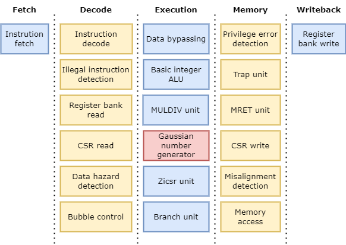

# riscv-vhdl-gauss-extension

This project contains an extended version of the RISC-V CPU that can be found at [riscv-vhdl](https://github.com/Samulix20/riscv-vhdl). Please checkout the README of said project before continuing. 

This version implements a custom extension that allows generating random gaussian values with a single ASM instruction. This extension was designed to accelerate the inference process of Bayesian Neural Networks in small CPUs.

## Gaussian number generator

The gaussian number generator unit is formed by 12 31 bit Linear-feedback shift registers (LSFR) and a tree of adders which is pipelined to minimize the required cycle time.

The sum of the 12 registers can be considered as a sum of 12 independent uniform distributions which, as a consequence of the central limit theorem, tends to a normal distribution.

The generator is added in the execution stage of the processor pipeline.

## Extension definition

This extension adds 2 new instructions to the RISC-V set, `genum rd` and `setseed rs1, rs2`. The execution latency of both instructions is 1 cycle.

The `genum` instruction generates a gaussian random value and stores it in the register `rd`.

The `setseed` instruction sets the internal value of the `rs1` LFSR to the value of the register `rs2`. This instruction can be used to change the value of any of the 12 LFSR. Because the generator is pipelined the generated numbers use the new seed after 4 cycles.

Both instructions use the R-Type encoding.

|         | funct7  | rs2   | rs1   | funct3 | rd    | opcode  |            |
|---------|---------|-------|-------|--------|-------|---------|------------|
| setseed | 0000000 | xxxxx | xxxxx | 000    | 00000 | 0001011 |            |
| MASK    | 1111111 | 00000 | 00000 | 111    | 11111 | 1111111 | 0xFE007FFF |
| MATCH   | 0000000 | 00000 | 00000 | 000    | 00000 | 0001011 | 0xB        |

|       | funct7  | rs2   | rs1   | funct3 | rd    | opcode  |            |
|-------|---------|-------|-------|--------|-------|---------|------------|
| genum | 0000000 | 00000 | 00000 | 001    | xxxxx | 0001011 |            |
| MASK  | 1111111 | 11111 | 11111 | 111    | 00000 | 1111111 | 0xFFFFF07F |
| MATCH | 0000000 | 00000 | 00000 | 001    | 00000 | 0001011 | 0x100B     |

## Compiler modifications

In order to use these new instructions the compiler must be updated. The directory `compiler` contains two modified files of the RISC-V GNU Compiler Toolchain source which add support the new instructions.

The `riscv-opc.h` must be updated at `binutils/include/opcode/`.

The `riscv-opc.c` must be updated at `binutils/opcodes/`.

The compiler must be configured with the following flags:

    --with-arch=rv32iam --with-abi=ilp32 --with-target-cflags=-mno-div
